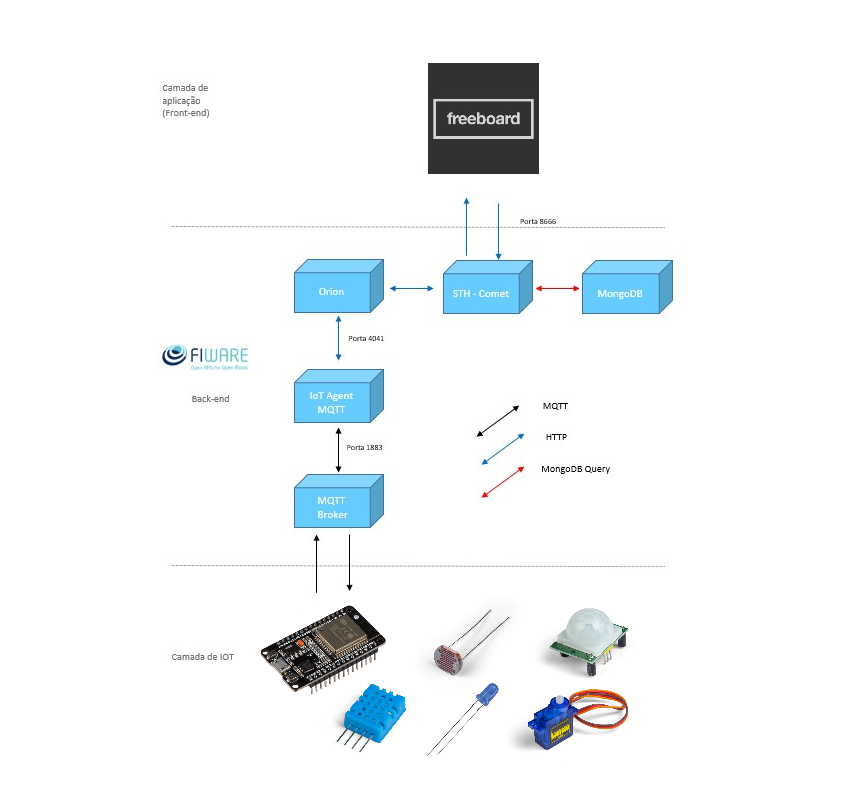
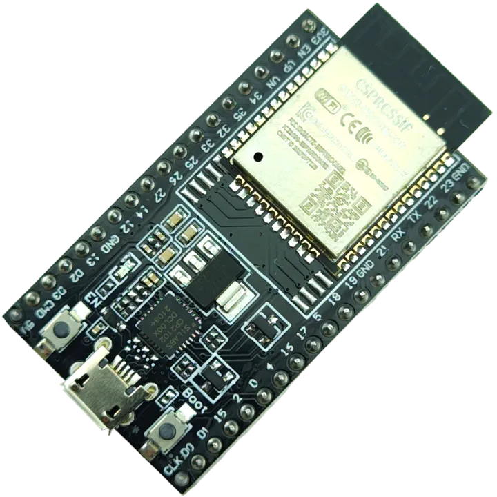
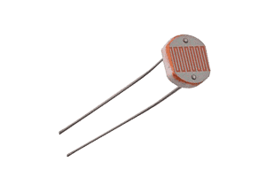
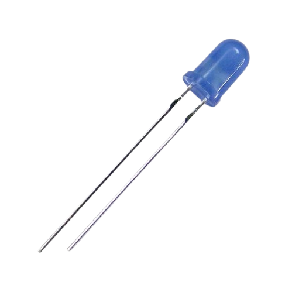
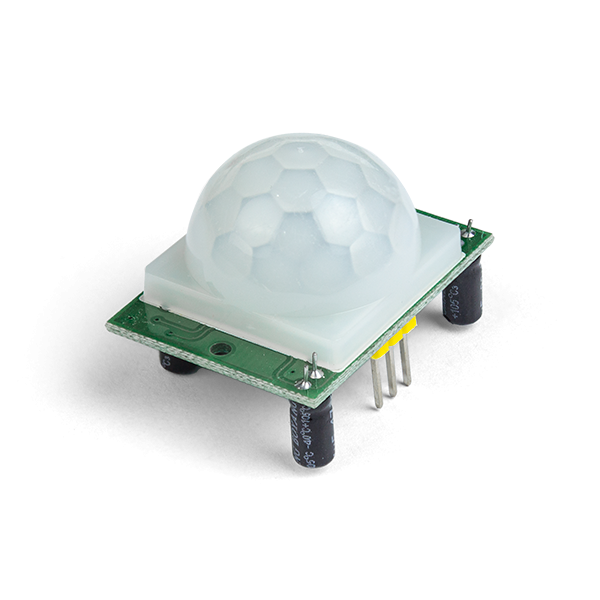
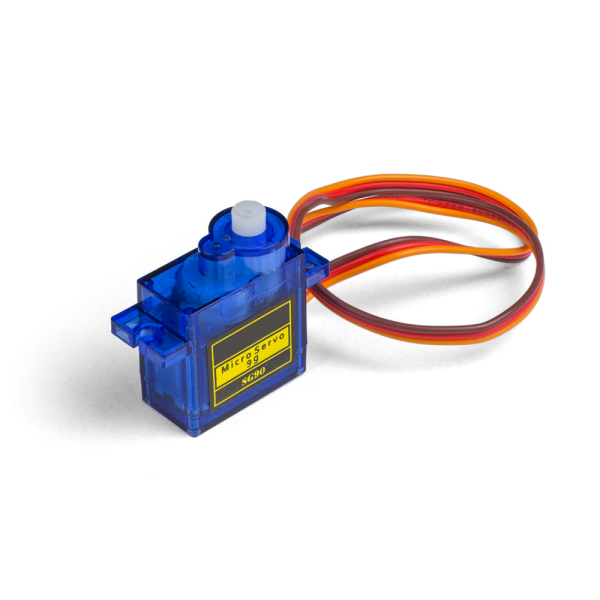

# Desenvolvimento da arquitetura de uma aplicação IoT para Eficiência Energética: 

A empresa de eficiência energética Akona Energy adotou uma arquitetura de aplicação IoT (Internet of Things) para otimizar o consumo de energia de seus clientes. Nesse contexto, o código fornecido desempenha um papel importante em coletar, analisar e enviar dados ambientais relevantes. O projeto detalha-se da seguinte forma:

💡 **Coleta de Dados Ambientais:**

- O código utiliza sensores para coletar informações ambientais, incluindo luminosidade, umidade e temperatura.
- Um sensor de luz (LDR) é usado para medir a luminosidade ambiente.
- O sensor DHT11 é empregado para medir a temperatura e a umidade do ambiente.

🚶‍♂️ **Sensor de Presença:**

- Um sensor de presença (PIR) é utilizado para detectar movimentos no ambiente.

⚙ **Controle de Dispositivos:**
- O projeto permite controlar dispositivos, como LEDs, com base nas condições ambientais e no sensor de presença.
- A lógica do código acende o LED quando a luminosidade é baixa ou o sensor de presença detecta movimento.

🔊 **Comunicação MQTT:**

- O código estabelece uma conexão MQTT para enviar e receber dados.
- Os dados de luminosidade, temperatura e umidade são publicados em tópicos MQTT específicos para que possam ser monitorados e analisados remotamente.

📈 **Climatização Inteligente:**

- Com base nas leituras de temperatura e umidade, o projeto apresenta uma lógica para controlar um sistema de climatização.
- Quando a temperatura é alta e a umidade é adequada, o sistema de climatização é ligado, simulado pelo movimento de um servo motor.

⚡ **Monitoramento e Eficiência Energética:**

- Os dados coletados pelos sensores podem ser usados para otimizar o consumo de energia.
- A empresa Akona Energy pode usar esses dados para tomar decisões informadas sobre iluminação, climatização e outros dispositivos, melhorando a eficiência energética de seus clientes.

## ✅ Arquitetura IoT: 
 

  

## 🔗 Camada de Aplicação(Front-End):

 

  

 

O projeto utilizará uma plataforma de dashboard chamada "Freeboard" como a base da camada de front-end. O Freeboard será responsável por exibir os dados coletados por meio de widgets e gráficos. Isso garantirá que as informações sejam apresentadas de maneira fácil de entender e intuitiva para os usuários.

## 🔗 Camada de Back-End:

 

  

 

O projeto fará uso da plataforma Fiware como seu componente de back-end. O Fiware é uma plataforma de código aberto que oferece uma estrutura aberta e padronizada para o desenvolvimento de soluções inteligentes baseadas em IoT. Nesse contexto, o Fiware desempenhará um papel fundamental na coleta, transporte e processamento dos dados provenientes dos sensores.

Esses dados serão encaminhados para um painel de controle (a camada de front-end) onde serão analisados e monitorados. O objetivo principal é garantir a otimização do consumo de energia e manter as condições adequadas de clima, possibilitando o controle eficiente dessas informações.

Essa plataforma Fiware proporciona a base tecnológica necessária para a construção de uma solução completa e integrada, permitindo a gestão inteligente dos dados coletados e fornecendo uma experiência aprimorada aos usuários finais.

---

A camada de back-end abriga componentes essenciais para a coleta, armazenamento e gerenciamento de dados. Os principais componentes incluem:

**Orion Context Broker:**
- O Orion Context Broker gerencia as entidades e o contexto dos dispositivos IoT, garantindo coleta 	e atualização de dados em tempo real.

**STH-Comet:**
- O STH-Comet é responsável pelo armazenamento de dados históricos, incluindo informações coletadas pelos sensores ao longo do tempo, permitindo análises retrospectivas e detecção de 	tendências. 

**IoT Agent MQTT:**
- Este agente IoT estabelece a comunicação eficaz entre os dispositivos IoT e a plataforma IoT, garantindo a transmissão confiável de dados.

**Banco de Dados NoSQL MongoDB:**
- O MongoDB armazena entidades, registros, subscrições e dados históricos, oferecendo 	escalabilidade e eficiência na gestão de dados.

**Eclipse-Mosquitto:**
- Um broker MQTT essencial para gerenciar a comunicação bidirecional entre os dispositivos de IoT e a aplicação.

A interação entre essas camadas é crucial para o funcionamento eficiente da aplicação IoT. Os dados são processados pela camada de back-end, armazenados no MongoDB e disponibilizados para análise por meio da camada de aplicação.

## 🔗 Camada de IoT:

 

1. **ESP32:** O ESP32 é um microcontrolador de baixo consumo de energia amplamente usado em projetos de IoT. Ele atua como o cérebro do dispositivo IoT, executando programas que controlam a coleta de dados, a comunicação e outras tarefas. O ESP32 é responsável por conectar-se à rede (Wi-Fi, Bluetooth, ou outras tecnologias), coletar dados do sensor e enviar esses dados para a camada de back-end.

 

  

 

2. **Sensor LDR (Light Dependent Resistor):** O sensor LDR é um componente que detecta a intensidade da luz no ambiente. Ele é um dos dispositivos sensores comumente usados em projetos IoT para medir a luminosidade. 

 

  

3. **Sensor DHT:** Um sensor DHT é um dispositivo que mede a temperatura e a umidade do ambiente e fornece leituras digitais ou analógicas. É amplamente usado em projetos de IoT e automação residencial devido à sua facilidade de uso e baixo custo.

 

  

4. **LED:**  Componente eletrônico semicondutor que emite luz quando uma corrente elétrica passa por ele.

 

  

5. **Sensor PIR:** É um dispositivo que detecta movimento de objetos que emitem calor no espectro infravermelho. Esses sensores são comumente usados para detectar a presença de pessoas ou animais em ambientes internos e externos. 

 

  

5. **Servo Motor:** Um servo motor é um dispositivo eletromecânico que converte um sinal de controle em um movimento preciso. Eles são usados em uma variedade de aplicações, desde robótica até sistemas de controle de posição e velocidade. 

 

  

---

## 🔗 Instruções de Uso:

Para utilizar o código fornecido e implementar o projeto de eficiência energética da Akona Energy, siga as seguintes etapas:

**1. Componentes Necessários**

- ESP32 (ou outro microcontrolador compatível);
- Sensor LDR (Light Dependent Resistor);
- Sensor DHT11 (ou outro sensor de temperatura e umidade);
- Sensor PIR (Sensor de Presença);
- LED;
- Servo Motor;
- Conexão Wi-Fi;
- Plataforma IoT (como Fiware, para a camada de back-end).

**2. Configuração do Ambiente de Desenvolvimento:**

- Certifique-se de que você tenha um ambiente de desenvolvimento configurado para programar o ESP32, como o Arduino IDE ou a plataforma de desenvolvimento ESP-IDF.

**3. Conexão de Hardware:**

- Conecte os componentes ao ESP32 conforme as pinagens definidas no código. Isso inclui o sensor LDR, o sensor DHT, o sensor PIR, o LED e o servo motor. Verifique os pinos definidos no código e faça as conexões corretamente.

**4. Configuração de Rede Wi-Fi:**

- Altere as constantes SSID e PASSWORD para corresponder às configurações da sua rede Wi-Fi, para que o ESP32 possa se conectar à rede.

**5. Configuração MQTT:**

- Defina o endereço do Broker MQTT e a porta na variável BROKER_PORT.

**6. Carregando o Código:**

- Compile e carregue o código para o ESP32 usando o ambiente de desenvolvimento escolhido.

**7. Monitoramento e Controle:**

- Após carregar o código, o ESP32 começará a coletar dados ambientais (luminosidade, temperatura e umidade) e detectar movimento com o sensor PIR.
- Os dados coletados serão enviados via MQTT para o Broker MQTT definido.
- O código também controla a iluminação (LED) com base nas condições de luminosidade e detecção de movimento.
- Um servo motor é controlado com base nas leituras de temperatura e umidade, simulando um sistema de climatização.

**8. Monitoramento Remoto:**

- Você pode configurar um aplicativo ou plataforma IoT para receber os dados publicados nos tópicos MQTT correspondentes.
- Os dados coletados podem ser usados para análise e otimização do consumo de energia.

**9. Eficiência Energética:**

- Use os dados coletados para tomar decisões informadas sobre o uso de dispositivos, como iluminação e sistemas de climatização, a fim de melhorar a eficiência energética.

 

## 🔗 Dependências:
 

**Conectividade de Rede:**

- Dependência de uma infraestrutura de rede Wi-Fi confiável para a comunicação com a camada de back-end.